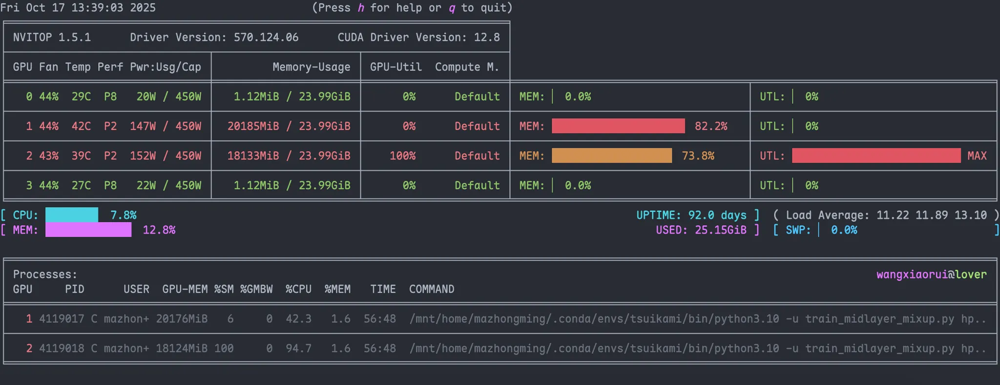

## 作业提交

### 批处理提交sbatch

批处理提交作业，提交后立即返回该命令行终端，用户可进行其它操作。

```bash
#!/bin/bash
#SBATCH -J my_job                 # 作业名
#SBATCH --cpus-per-task=4         # 任务使用的 CPU 核心数为 4
#SBATCH --mem=20000				  # 默认内存申请为12GB * GPU数量
#SBATCH -t 3-00:00:00             # 任务运行的默认时间为3天，最长14天
#SBATCH --gres=gpu:1              # 使用 1 块 GPU 卡

# 设置运行环境，需要首先load conda
module load conda
conda activate <env_name>

# 输入要执行的命令
python main.py
```

将上面的代码保存为符合格式要求的脚本文件（`#SBATCH`作为bash注释，不会影响bash运行，但SLURM在作业分配时会读取这些配置），然后通过如

```shell
sbatch job.sh
```

来提交代码。

### 交互式提交srun

用户在该终端需等待任务结束才能继续其它操作，在作业结束前，如果提交时的命令行终端断开，则任务终止。一般用于短时间小作业测试。

`srun --gres gpu:1 --pty bash`

`srun --gres gpu:1 python main.py`

这里推荐估算自己实验所需要的

`srun --gres shard:40` for 40GB GPU


默认分配方式

1GPU 配4个CPU配12GB内存


## 作业查看

### 查看队列squeue

squeue：显示队列中的作业及作业步状态，含非常多过滤、排序和格式化等选项。

`squeue` 显示的信息包括以下内容

- `JobID`: 作业编号
- `PARTITION`: 作业在哪个分区上运行
- `NAME`: 作业名称，默认是作业脚本的名字
- `USER`: 作业的所有者
- `ST`: 作业当前状态，详见 Job State Codes，常见的有
  - `CG` 作业正在完成
  - `F` 作业失败
  - `PD` 作业正在等待分配资源
  - `R` 作业正在运行
- `TIME`: 作业已运行时间
- `NODES`: 作业占用的计算节点数
- `NODELIST`: 作业占用的计算节点名
- `(REASON)`: 作业正在等待执行的原因，详见 [Job Reason Codes](https://slurm.schedmd.com/squeue.html#lbAF)，常见的有

  - `AssoGrpCpuLimit`: 账号名下所有小伙伴正在使用的CPU总数达到了账号的CPU数量限额
  - `AssoGrpGRES`: 账号名下所有小伙伴正在使用的GPU总数达到了账号GPU数量限额
  - `Priority`: 作业正在排队等待
  - `QOSMinGRES`: 提交到GPU分区的作业没有申请GPU资源
  - `QOSMaxWallDurationPerJobLimit`: 设置的时间超过了比如`medium` QOS 限制的`--time=14-00:00:00`，14天

在`NODELIST`一栏，作业在运行时会显示所在节点，如下所示：

```bash
moon$ squeue --me
JOBID PARTITION     NAME     USER ST       TIME  NODES NODELIST(REASON)
28537   highend code-tun ourunmin  R       0:51      1 node36
```

在有作业运行时候，可以登录到对应节点查看运行情况，可以使用`nvidia-smi`（驱动工具）或者`nvitop`（第三方工具，需要自己安装在python环境中）查看GPU使用情况。

```bash
moon$ ssh node36
empress$ nvitop
```


- 如果你的程序使用了显存，那么就会显示在下面
- 如果一个节点有4张显卡，而你只请求了其中一张，那么会被分配0,1,2,3中的随机一张，可以在底下的进程中看自己的任务跑在哪个显卡上
- 看上面部分自己任务对应的显卡的使用情况，MEM对应显存使用，UTL对应显卡运行效率
- 如果MEM占用低，可以考虑调整batchsize等尽量跑满，或是在一张卡上多跑几个任务
- 如果MEM有占用但UTL一直是0或者很低，说明显卡的运行效率很低或根本没用到显卡
- **UTL占用高，说明服务器资源被充分使用了**

注：没有作业会显示没有权限

```bash
moon$ ssh node31
Access denied by pam_slurm_adopt: you have no active jobs on this node
```

退出：使用exit(或`Ctrl+D`)退回到登录节点
```bash
empress$ exit
moon$
```

### 查看作业记账情况sacct

sacct：显示激活的或已完成作业或作业步的记账信息。

sreport：生成集群资源使用报告。


### 查看节点情况sinfo

```
PARTITION AVAIL  TIMELIMIT   JOB_SIZE ROOT OVERSUBS     GROUPS  NODES       STATE RESERVATION NODELIST
highend      up   infinite          1   no    YES:4        all      2       mixed             node[29,36]
highend      up   infinite          1   no    YES:4        all      1   allocated             node39
normal*      up   infinite          1   no    YES:4        all      1     drained             node26
normal*      up   infinite          1   no    YES:4        all      2       mixed             node[34,38]
normal*      up   infinite          1   no    YES:4        all      1   allocated             node37
normal*      up   infinite          1   no    YES:4        all      1        idle             node35
normal*      up   infinite          1   no    YES:4        all      2        down             node[31,33]
debug        up    1:00:00          1   no    YES:4        all      1       down*             node32
ultra        up   infinite          1   no    YES:4        all      1     drained             node40
```

主要输出事项：
- AVAIL：up表示可用，down表示不可用。
- TIMELIMIT：作业运行墙上时间（walltime，指的是用计时器，如手表或挂钟，度量的实际时间）限制，infinite表示没限制，如有限制的话，其格式为“days-hours:minutes:seconds”。
- STATE：节点状态，可能的状态包括：
> - allocated、alloc：已分配。
> - completing、comp：完成中。
> - down：宕机。
> - drained、drain：已失去活力。
> - draining、drng：失去活力中。
> - fail：失效。
> - failing、failg：失效中。
> - future、futr：将来可用。
> - idle：空闲，可以接收新作业。
> - maint：保持。
> - mixed：混合，节点在运行作业，但有些空闲CPU核，可接受新作业。
> - perfctrs、npc：因网络性能计数器使用中导致无法使用。
> - power_down、pow_dn：已关机。
> - power_up、pow_up：正在开机中。
> - reserved、resv：预留。
> - unknown、unk：未知原因。
> 
> 注意，如果状态带有后缀*，表示节点没响应。


## 作业操作

### 取消作业scancel

scancel：取消排队或运行中的作业或作业步，还可用于发送任意信号到运行中的作业或作业步中的所有进程。

如果用户要取消作业，先运行 squeue 命令查询作业编号数字 JobID ，然后运行以下命令取消作业
```bash
scancel <JobID>
```
如果要取消用户的所有作业
```bash
scancel -u ${USER}
```

## TBC

更多信息请参考:
- https://scc.ustc.edu.cn/zlsc/user_doc/html/slurm/slurm.html